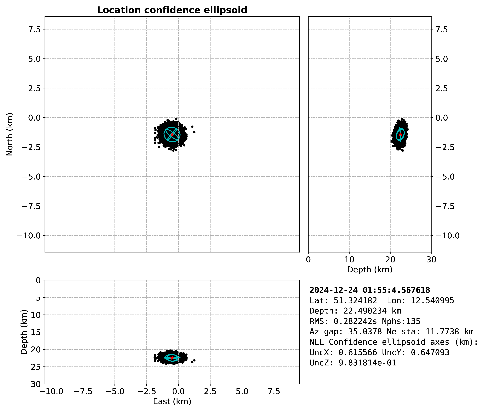

<p align="center">
  
</p>

## :memo: Description

TieBeNN (**Tie**fen**Be**stimmung mittels **N**euronaler **N**etze) is an event-based wrapper that leverages several tools—some machine-learning-based, some traditional—to automatically generate phase picks for probabilistic hypocenter estimation of local events using [NonLinLoc](http://alomax.free.fr/nlloc/).

## :gear: Workflow

Using the coordinates (latitude and longitude) and the UTC time of a local event as input, TieBeNN processes seismic event locations through the following stages:

1. **Waveform data fetching**: A catalog of stations around the epicenter is produced. Then, waveform data in miniSEED format are retrieved using an ObsPy client on FDSN servers or from a SDS directory structure.

1. **Waveform data preprocessing**: Empty channels are removed, masked channels are split, and data are detrended and bandpass filtered. Optionally, stations within 100 km from the epicenter are denoised using the DeepDenoiser model [(Zhu et al. 2019)](https://arxiv.org/abs/1811.02695).

1. **Phase picking**: P- and S-phases (first arrivals) are detected using phase-picking models (either EQTransformer or PhaseNet, available in the [SeisBench](https://github.com/seisbench/seisbench) toolbox).

1. **Phase association**: Detected picks are passed through phase associators to discard possible false detections. TieBeNN supports [PyOcto](https://github.com/yetinam/pyocto) and [GaMMA](https://github.com/AI4EPS/GaMMA).

1. **Export outputs**: Event-associated phase picks are exported to CSV files, including station coordinates, arrival times, pick probabilities, and signal-to-noise ratios. NonLinLoc input files are generated. Optionally, waveform and pick figures per station, as well as phase association plots, are produced.

1. **Probabilistic hypocenter estimation**: The generated files are used by NonLinLoc for hypocenter estimation. Optionally, figures are created: :one: epicenter and stations on a map; :two: waveforms with picks, sorted by epicentral distance; :three: location confidence ellipsoid.

1. **Location quality assessment**: Location metrics are gathered to compute the Location Quality Score (LQS) and to generate a visualization. :memo: **A description of this metric should be available in a manuscript, currently in preparation** :memo:

> :point_right: **Note**: TieBeNN loops through this process until the minimum required detections within a given epicentral distance are obtained. If not, the search radius is gradually expanded. If phase picks are insufficient within 200 km, the run ends with an unsuccessful event location.

## :white_check_mark: Requirements

* **Python 3.9** or later (successfully tested with Python 3.10 and 3.12).
* **SeisBench**, the ML model toolbox used for phase picking and denoising.
* **NonLinLoc**, a suite of C programs for probabilistic hypocenter estimation.
* **GMT** and **PyGMT**, for map generation.
* **PyOcto**, phase associator after [Münchmeyer (2024)](https://seismica.library.mcgill.ca/article/view/1130)
* **Pyrocko**, open-source seismology toolbox and library.
* **GaMMA**, phase associator after [Zhu et al. (2022)](https://agupubs.onlinelibrary.wiley.com/doi/full/10.1029/2021JB023249)
* **NLLGrid**, a Python class for handling NonLinLoc grid files. Hosted [here](https://github.com/claudiodsf/nllgrid).

## :hammer_and_wrench: Installation

Tested on Linux Mint and Lubuntu (Debian-based syntax used here).

### :hammer_and_wrench: Create a virtual environment

It is highly recommended to use a *virtual environment* to install software with several requirements. We move to the folder where we will install the virtual environment (do not forget to replace the names between angle brackets). The created environment can be then activated using `source`:

```bash
python3 -m venv <path_to_virtual_environment>/<venv_tiebenn>
source <path_to_virtual_environment>/<venv_tiebenn>/bin/activate
```

> :bulb: **TIP**
>
> You can add an alias by including the following line at the end of your `~/.bashrc` for quick access:
>
> ```bash
> alias <alias_name>='source <path_to_virtual_environment>/<venv_tiebenn>/bin/activate'
> ```
> Save changes. Then reload:
> ```bash
> exec bash
> ```

### :hammer_and_wrench: Install Python dependencies

Installing SeisBench will install most of Tiebenn's dependencies. You can install a pure-CPU version of SeisBench, in case it is necessary. For this, after activating the virtual environment by using the previously created alias, type:

```bash
pip install torch torchvision torchaudio --index-url https://download.pytorch.org/whl/cpu
pip install seisbench
```

If you are working on a GPU machine, then you can skip the first line and directly install SeisBench with the second line. Then, you can proceed with the installation of the remaining dependencies:

```bash
pip install pygmt pyocto pyrocko nllgrid
pip install git+https://github.com/wayneweiqiang/GaMMA.git
```

### :hammer_and_wrench: Installing NonLinLoc and setting paths

NonLinLoc must be individually compiled to make sure it is compatible with the machine where TieBeNN will be running. First we will create the directory `<tiebenn_directory>/utils/nonlinloc` and within it, we clone the NonLinLoc repository:

```bash
mkdir -p <tiebenn_directory>/utils/nonlinloc
cd <tiebenn_directory>/utils/nonlinloc
git clone https://github.com/ut-beg-texnet/NonLinLoc.git
cd NonLinLoc/src
mkdir bin
cmake .
make
cd bin
cp Vel2Grid* Grid2* NLLoc ../../../
```

> :exclamation: **Important**
>
> Do not use NonLinLoc's latest release directly, as it contains unresolved bugs, whose fix are still unreleased.

Set NonLinLoc in your `PATH`:

```bash
echo 'export PATH=${PATH}:<tiebenn_directory>/utils/nonlinloc/' >> ~/.bashrc
exec bash
```

### :hammer_and_wrench: Install GMT

GMT version 6.0+ is recommended (officially 6.4+ for PyGMT). [The official GMT documentation](https://docs.generic-mapping-tools.org/dev/install.html) has installation instructions, including instructions to migrate from earlier versions, and of course, a bunch of tutorials.

## :test_tube: Usage

This section shows an example which should make TieBeNN's usage clear.

### :inbox_tray: Input file

Input format:
```text
YYYY-MM-DDTHH:MM:SS  latitude  longitude
```
Example:
```text
2024-12-24T01:55:04 51.337  12.548
```

### :receipt: Syntax

With the virtual environment activated (see above), TieBeNN follows this syntax:

```bash
python tiebenn.py --event_file <EventFile> --max_epic_dist <MaxEpDist> --picker <Picker> --client <Client> --sds_dir <SDSDir> --min_detections <MinDetections> --plots <Plots> --vel_mode <VelMode> --velmod <VelMod> --ph_assoc <PhaseAssoc> --denoise <Denoise> --mult_windows <MultiWindows>
```

| Parameter | Description |
|:----------|:-----------:|
| **EventFile** | Full path to input file with preliminary epicenter (latitude, longitude) and UTC datetime |
| **MaxEpDist** | Maximum epicentral distance (in km) for stations on which phase picks will be detected |
| **Picker** | Select model for phase picking. **EQTransformer** can be defined as `sb_eqt`, `seisbench_eqt`, `seisbench_eqtransformer`, `sb_eqtransformer` and **PhaseNet** as `sb_pn`, `seisbench_pn`, `sb_phasenet`, `seisbench_phasenet`. Not case sensitive |
| **Client** | If set to `SDS`, it will access a directory with SeisComp3 structure. It will try to fetch the available waveforms from the stations in the station list within `MaxEpDist` km. Afterwards, it will try to fetch stations using FDSN clients to access their services. If set to `FDSN`, it skips the search for a SDS directory |
| **SDSDir** | A string with the full path to the SeisComp3 directory. This parameter must be defined if `Client` is set to `SDS` |
| **MinDetections** | Minimum amount of stations on which P- or S- phase picks must be detected for the detection loop to end |
| **Plots** | If set to True, it will plot the waveforms recorded on each stations with at least one phase detection. It will also plot all the phase picks associated to the event sorted by epicentral distance, as well as plots of the locations: epicenter and stations with detections on a map, waveforms with phase picks sorted by epicentral distance, and confidence ellipsoid of event location |
| **VelMode** | This parameter decides how to choose a seismic velocity model for the event location. Options are `automatic` (`automatic`, `auto` or `a`) for choosing a local velocity model based on the epicenter (if available, otherwise the layer-over-halfspace model used at EdB is used as default) and `manual` (`manual`, `man`, `m`) for choosing the velocity model manually. In this case, the parameter `VelMod` must be defined |
| **VelMod** | The number corresponding to the model which will be used for hypocenter location with NonLinLoc. [See the full list here](https://192.168.11.188/dzreorg/software/tiebenn/-/blob/main/velocity_models.md) _Note_: 3D velocity models have been tested, although I have still not found a region in Germany where using a 3D velocity model instead of a dedicated, local 1D velocity model results in a dramatic improvement in the event location quality and is worth the extra travel-time calculation time. The implementation of 3D velocity models for real-time event location is, at least momentarily, beyond the scope of this repository |
| **PhaseAssoc** | Phase associator. Options are `PyOcto` (`pyocto` or `p`) and `GaMMA` (`gamma` or `g`). Not case sensitive |
| **Denoise** | Boolean parameter. If true, the DeepDenoiser model will be applied on the waveforms of stations within 100 km in epicentral distance |
| **MultWindows** | Boolean parameter. If true, it makes the phase picker to look for P- or S-waves in moving windows, which helps to address the prediction inconsistency inherent to machine-learning-based models |

To locate the event with example UTC datetime and coordinates specified above, we type in the terminal (in the **tiebenn** directory and with our virtual environment activated):

```
python tiebenn.py --event_file <full_path_to_example_event> --max_epic_dist 150 --picker SeisBench_PhaseNet --client FDSN --min_detections 3 --plots True --vel_mode auto --ph_assoc PyOcto --denoise True --mult_windows True
```

### :outbox_tray: Output

If the location was successful, you’ll see something like:
```
##############################################################
NonLinLoc: Location completed.
Origin time: 24-12-2024_01:55:4.517789
             Lat:51.328045 Long:12.543796 Depth: 22.685547 km
--------------------------------------------------------------
Location quality:
RMS:0.285177 Number of phases: 130 Gap: 35.032 Distance from hypocenter to nearest station: 12.077 km
Ellipsoid semi-major axis: 1.030196e+00
##############################################################
```

With `--plots True`, the following figures are also generated:

* Phase picks on waveforms:
  <p align="center">
    
  </p>

* Associated phases:
  <p align="center">
    
  </p>

* Map: epicenter and stations:
  <p align="center">
    
  </p>

* Location confidence ellipsoid:
  <p align="center">
    
  </p>

* Location Quality Score:
  <p align="center">
    
  </p>

## :wrench: To Do

Planned improvements:
* Create Sphinx documentation
* Build a containerized version

> :point_right: **Ideas welcome!** Please submit feature suggestions via new issues.

## :books: Documentation

:pizza: :beer: Hungry for more detailed information? A full Sphinx-based documentation is in the works. Stay tuned! :construction:

## :book: References

A detailed paper/software report on TieBeNN is currently in preparation.

## :brain: Authors and Acknowledgment

C. Ramos (maintainer)

## :construction: Project Status

Clearly under development.

## :link: Useful Links

- [DeepDenoiser example](https://colab.research.google.com/github/seisbench/seisbench/blob/main/examples/02b_deep_denoiser.ipynb)
- [NonLinLoc GitHub](https://github.com/ut-beg-texnet/NonLinLoc)
- [PyGMT guide and MANY examples](https://www.pygmt.org/dev/index.html)
- [Pyrocko applications](https://pyrocko.org/)

## :balance_scale: License

This project is released under the **GNU General Public License v3.0 (GPLv3)**.
In short, it's open-source and free to use, modify, and redistribute — but any modified version that is shared must also remain open under the same license.

See the full [LICENSE](LICENSE) file for legal details.

### :mag: TL;DR (not legally binding!)

- :white_check_mark: You can use, modify, and share this code freely.
- :scroll: If you share a modified version, you **must** also share the source code.
- :brain: The license ensures that TieBeNN and its derivatives stay open-source.
- :x: No warranties — the software is provided *as is*.
